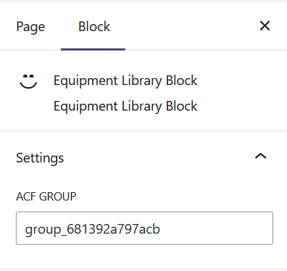
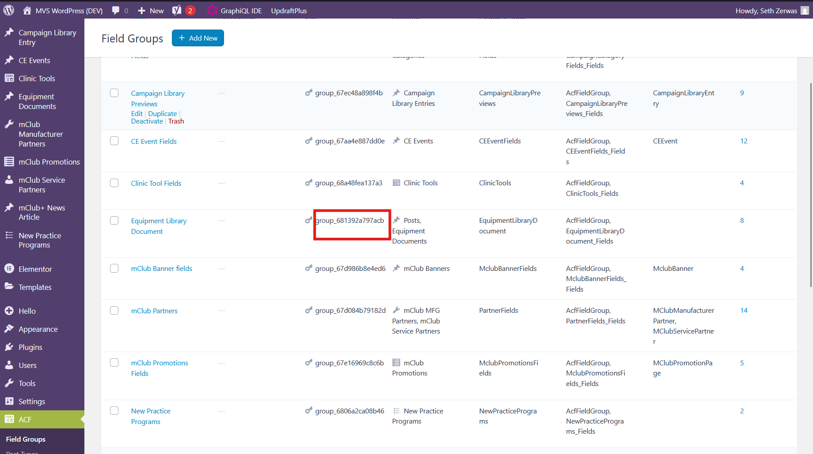

This document outlines the main scripts used by the **MVS WordPress Plugin**.

---

### Relevant project files and directories

Below are the relevant folders and files:

| Path                                               | Description                                                                                  |
| -------------------------------------------------- | -------------------------------------------------------------------------------------------- |
| `/build/blocks/equipment-library-block`            | This is where the Equipment Library block lives.                                             |
| `/build/blocks/equipment-library-block/block.json` | Configuration file for the equipment library block                                           |
| `/build/blocks/equipment-library-block/render.php` | Most important file in the plugin, all HTML, CSS, JS, and PHP changes are made in this file. |

---

### Key Scripts

These are the most frequently used commands for development and quality assurance.

- **`npm start`**: Starts the development version of the plugin, will see changes on development site while this is active.
- **`npm run build`**: Compiles the plugin for production. This is ran before the plugin changes are moved to production.

---

### Package Manager

This project uses **npm** as its package manager.

- **`packageManager`**: `npm@11.5.2`

---

### How to use the Equipment Library block

|  | This is the settings area of the Equipment Library block, in the **ACF Group** field, enter the group ID of the **Equipment Document** ACF field.              |
| ------------------------------------------------------------------------------ | -------------------------------------------------------------------------------------------------------------------------------------------------------------- |
|                  | In the red box to the left, is the ACF **Group ID** for the **Equipment Document**. Enter this value in the **Equipment Library Block Settings** listed above. |

---

CE Credit Block Information Here
